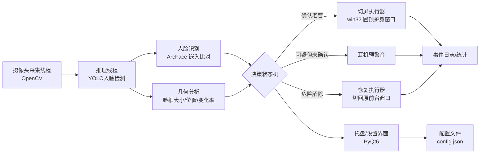
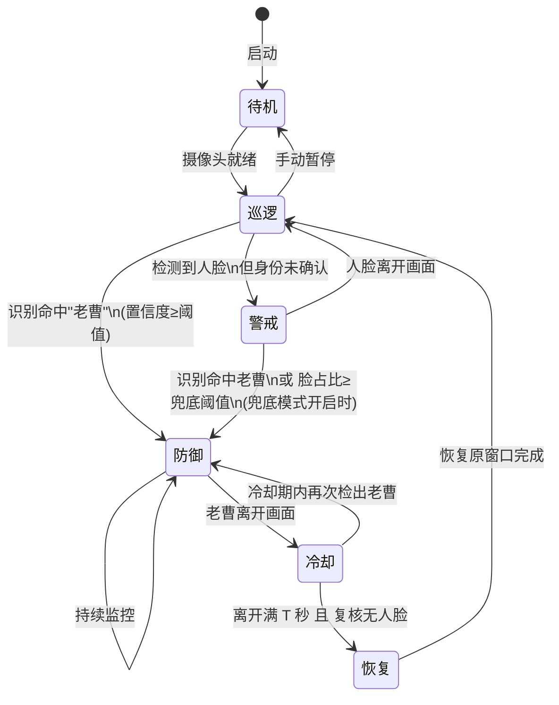

# 《全自动防老曹后视镜》软件需求设计书

| 项 | 内容 |
|---|---|
| 项目名称 | 全自动防老曹后视镜（Auto Anti-LaoCao Rearview Mirror，简称 AARM） |
| 文档版本 | v0.1（草案，待确认项见附录） |
| 编写日期 | 2026-08-29 |
| 项目性质 | 个人自用桌面软件（Windows） |

---

## 0. MVP 范围锁定（v0.1，2026-08-29 与需求方确认）

第一版只求**最小闭环跑通**，范围从 §6 裁剪如下：

| 范围 | 内容 | 对应原需求 |
|---|---|---|
| ✅ 本版实现 | 摄像头采集、人脸检测、防抖、自动切屏、延迟自动恢复、后视镜预览窗（含状态红/绿指示）、可选提示音 | FR-01、FR-02、FR-05（降级为"检测到脸即触发"）、FR-06、FR-07、FR-09、FR-11 |
| ⏩ 推迟 v0.2 | 老曹人脸库与识别、兜底/白名单策略、静默托盘模式、设置界面、热键、事件日志统计 | FR-03、FR-04、FR-10、FR-12、FR-13、FR-14 |
| ❌ 暂不做 | 开机自启、后视镜皮肤、多护身界面轮换 | FR-15~17 |

**MVP 判定规则（替代 §5.3）**：检出人脸 且 脸框高 ≥ 画面高 × 15%（可配置，用于过滤远处路人）且 连续 3 帧 → 切屏；人脸离开画面 25 s 且复核无脸 → 自动切回。**不区分是谁的脸**——宁错切不放过。

**MVP 交付形态**：单文件 `main.py` + `config.json`，命令行运行，控制台输出事件日志，无 GUI 设置界面。

---

## 1. 项目背景与目标

### 1.1 背景

使用者在课室用电脑自学/自习时，指导教师（下文简称"老曹"）经常从背后悄无声息接近，突袭检查屏幕内容，随后训话，对使用者造成惊吓与心理压力。

使用者已将电脑摄像头朝向身后摆放，摄像头视野即身后区域，天然构成一面"电子后视镜"。

### 1.2 项目目标

利用该朝后摄像头，在老曹的脸进入视野时实时识别其身份，一旦确认即**在 1 秒内自动将屏幕切换至预先配置的"正规界面"**（如课件、教材 PDF、编程文档），从而：

1. 消除"被吓一跳"的惊吓源（先于老曹到达屏幕前完成切换）；
2. 屏幕内容永远经得起检查；
3. 全程无感、全自动，不需要使用者在学习时分心盯守。

### 1.3 成功标准

| 编号 | 标准 | 度量方式 |
|---|---|---|
| S-1 | 老曹出现在画面中到屏幕完成切换，端到端延迟 ≤ 1 s | 录屏计时 |
| S-2 | 对老曹正面接近场景，检出率 ≥ 95% | 自录测试视频回放统计 |
| S-3 | 同学路过 / 无人在场时误切率 ≤ 1 次/小时 | 实际使用日志统计 |
| S-4 | 长时间挂机（≥ 2 h）不崩溃、不明显拖慢学习用软件 | 挂机观察 + 任务管理器 |
| S-5 | 视频画面只在本机内存中处理，不落盘、不联网（除模型下载） | 代码审查 + 防火墙日志 |

---

## 2. 使用场景

**核心场景（SC-1 课室自习）**：笔记本 + 朝后摄像头摆在课桌，使用者戴耳机学习。老曹从后方任意方向走入画面 → 软件识别 → 切屏。老曹离开视野 → 延迟恢复原界面。

**衍生场景**：

- SC-2 宿舍/图书馆同理使用，只需更换"护身窗口"配置。
- SC-3 老曹突然从侧后方闪入（画面中直接出现一张较大的脸）——必须支持"人脸出现即大"的瞬时触发，不能只依赖"由远及近"的过程。
- SC-4 使用者主动暂停：去接水、上厕所时手动挂起，回来恢复。

## 3. 关键设计前提（已与需求方确认）

> 以下前提决定整体方案走向，变更需重新评审。

1. **摄像头朝后部署**：老曹接近时，镜头看到的是他的**正脸**，而非后脑勺。因此"识别老曹本人"是第一道、也是最可靠的防线；不存在"只看得到背影"的识别盲区（侧脸情况见风险 R-2）。
2. **画面中的脸 = 接近程度**：无需复杂测距，人脸框在画面中的尺寸占比即为危险等级的度量。
3. **误切代价小于漏切**：切错（同学路过被切一次）无实质损失；漏切（老曹到场而屏幕没切）直接社死。策略取向上"宁可错切，不可放过"。
4. **一切本地计算**：课室无稳定外网也必须工作；模型仅首次下载。

## 4. 系统总体架构

### 4.1 线程模型

| 线程 | 职责 | 频率 |
|---|---|---|
| 采集线程 | 抓帧、镜像、放预览队列 | 30 fps |
| 推理线程 | YOLO 检测 + 识别 + 决策输入 | 目标 10~15 fps（隔帧推理） |
| UI/托盘线程 | 界面、配置、托盘消息 | 事件驱动 |
| 执行器 | 切屏/恢复动作 | 事件触发（主线程安全调用 win32） |

摄像头与推理之间用最新帧覆盖队列（丢帧不排队），保证延迟不累积。

## 5. 决策逻辑设计（核心）

### 5.1 状态机

### 5.2 判定参数（默认值，均可在设置中调整）

| 参数 | 默认值 | 说明 |
|---|---|---|
| 识别置信度阈值 `ID_TH` | 0.45 | 与老曹人脸库余弦相似度超过即判定命中 |
| 防御触发脸占比 `NEAR_TH` | 脸框高 ≥ 画面高 × 18% | 兜底模式：有张大脸逼近但不认识 → 也切 |
| 防抖确认帧数 `N_CONFIRM` | 连续 3 帧 | 防单帧误检；3 帧 @10fps ≈ 0.3 s，叠加推理延迟仍满足 S-1 |
| 冷却时间 `T_COOLDOWN` | 25 s | 老曹离开画面后保持防御态的时长（他可能只是弯腰捡书） |
| 预警提前量 | 检出未识别人脸立即响 | 耳机短促提示音，仅在防御未触发时 |

### 5.3 判定规则汇总

1. **命中即切（主规则）**：任意一帧中检出人脸且与老曹人脸库比对命中 → 立即进入防御，无需等待"靠近"。
2. **兜底切（可开关，默认开）**：人脸占比超过 `NEAR_TH` 但身份未确认（低头、戴口罩、侧脸、光照差）→ 进入防御。理由：一张大到占画面 1/5 的陌生脸已经贴到身后，无论是不是老曹都该切。同学正常路过不会把脸凑到镜头前，误报可控。
3. **预警音**：检测到人脸但两条规则均未触发时，发一声短促提示音（可关）。它既是预警，也是"兜底是否该切"的参考。

### 5.4 恢复逻辑

进入冷却后：计时满 `T_COOLDOWN` 且**恢复前对当前帧再复核一次**（无人脸或人脸非老曹）→ 将屏幕切回"进入防御前记录的前台窗口"，回到巡逻态。冷却期内老曹再次出现则重新计时。

> 为什么不立即恢复：老曹离开视野不代表走远（可能去隔壁同学那儿），立即切回等于自曝。

## 6. 功能需求

优先级：P0 = 首版必须有；P1 = 首版应尽量有；P2 = 后续迭代。

| 编号 | 功能 | 描述 | 优先级 |
|---|---|---|---|
| FR-01 | 摄像头采集 | 支持选择摄像头设备（内置/外接 USB），分辨率 640×480 或以上，断开自动重连 | P0 |
| FR-02 | 人脸检测 | YOLO 人脸模型实时检测画面中所有人脸，输出框与置信度 | P0 |
| FR-03 | 老曹人脸库 | 支持从照片导入注册"目标人脸"（老曹），≥3 张不同角度；支持多目标（可再添加其他盯梢老师） | P0 |
| FR-04 | 人脸识别 | 对检出人脸提取特征并与库内比对，命中即触发 FR-06 | P0 |
| FR-05 | 兜底检测 | 可开关的"大脸逼近即切"规则（见 5.3 规则 2） | P0 |
| FR-06 | 自动切屏 | 触发后 ≤1 s 将预配置"护身窗口"置顶并获得焦点 | P0 |
| FR-07 | 恢复 | 危险解除后自动切回原窗口（见 5.4） | P0 |
| FR-08 | 护身窗口配置 | 指定一个（或按 Win/VsCode/浏览器分多个的）已打开窗口作为切屏目标；提供"测试切屏"按钮 | P0 |
| FR-09 | 后视镜预览窗 | 小窗实时显示身后画面，**水平镜像**（真后视镜观感），可拖动、可调大小、可隐藏 | P0 |
| FR-10 | 静默模式 | 无预览窗、仅托盘图标运行，防老曹发现软件本身；托盘菜单：暂停/恢复/设置/退出 | P1 |
| FR-11 | 耳机预警音 | 检出未确认人脸时播放提示音，音量/开关可配 | P1 |
| FR-12 | 设置界面 | 调整 5.2 全部参数、选择摄像头、管理人脸库、选择护身窗口 | P1 |
| FR-13 | 事件日志 | 记录每次触发/恢复的时间、置信度、截图（可选，仅存本地）；提供"本周被抓包次数"统计 | P1 |
| FR-14 | 快捷键 | 全局热键：一键暂停/恢复（如 Ctrl+Alt+P）、手动切屏（Ctrl+Alt+D） | P1 |
| FR-15 | 开机自启/最小化启动 | 选项 | P2 |
| FR-16 | 后视镜皮肤 | 预览窗套用车用后视镜边框样式（娱乐性） | P2 |
| FR-17 | 多护身界面轮换 | 按应用来源智能选择最合适的护身窗口 | P2 |

## 7. 非功能需求

| 编号 | 需求 | 指标 |
|---|---|---|
| NFR-1 | 响应延迟 | 检出命中帧 → 屏幕完成切换 ≤ 1 s（含防抖） |
| NFR-2 | 资源占用 | 纯 CPU 运行时 CPU ≤ 25%（现代 i5），内存 ≤ 1 GB；有 NVIDIA 显卡时自动用 GPU |
| NFR-3 | 稳定性 | 连续运行 ≥ 2 h 无崩溃；摄像头被其他程序占用时给出明确提示而非静默失败 |
| NFR-4 | 隐私 | 视频帧只在内存处理；不联网传输任何画面；截图日志默认关闭，开启时明示且仅存本地 |
| NFR-5 | 低干扰 | 防御态下不弹任何可见对话框；预警音 ≤ 0.3 s；托盘图标无闪烁广告式提醒 |
| NFR-6 | 易部署 | 单机安装：Python 环境 + `requirements.txt` 或打包 exe；首次运行引导完成人脸注册 |

## 8. 技术选型

| 层 | 选型 | 理由 |
|---|---|---|
| 语言 | Python 3.10+ | CV 生态最全，个人项目开发速度优先 |
| 采集/图像 | OpenCV (`cv2`) | 摄像头读取、镜像、缩放的事实标准 |
| 人脸检测 | **YOLOv8n-face**（ultralytics 生态） | 满足"用 YOLO"的原始设想；n 版模型 ~6 MB，CPU 亦可实时 |
| 人脸识别 | InsightFace (ArcFace) 或 `face_recognition`(dlib) | YOLO 只负责"找到脸"，"认出是不是老曹"需要识别模型；ArcFace 精度高、有 onnx 轻量版。备选 dlib 方案依赖更简单 |
| 兜底检测 | 同一 YOLO 模型的人脸框几何规则（5.2） | 不引入第二模型，零额外开销 |
| 切屏 | `pywin32`：`SetForegroundWindow` + `SetWindowPos(HWND_TOPMOST)` | 把预打开的护身窗口置顶，最可靠；备用方案：`pyautogui` 模拟 `Win+D`、`Ctrl+Win+→` 切虚拟桌面 |
| 恢复 | 记录防御前 `GetForegroundWindow()` 句柄，恢复时 `SetForegroundWindow` 切回 | — |
| UI | `PyQt6`（预览窗 + 设置窗）+ `pystray`/QSystemTrayIcon（托盘） | 桌面端成熟 |
| 音频 | `winsound` | 标准库，播 beep 足够 |
| 配置 | `config.json`（JSON，人肉可读可改） | — |
| 打包 | `PyInstaller`（P2 可选） | — |

**模型部署说明**：首次运行检测到模型文件缺失时提示下载（yolov8n-face.pt ≈ 6 MB，ArcFace w600k.onnx ≈ 130 MB）。下载成功后完全离线运行。

## 9. 界面设计

### 9.1 后视镜预览窗（P0）

- 默认停靠屏幕右上角，约 260×195，圆角、置顶、半透明边框（可调）。
- 画面水平镜像，叠加元素：当前状态角标（巡逻🟢/警戒🟡/防御🔴）、检出人脸框（识别命中画红框+名字，未识别画黄框）。
- 双击可折叠为 40×40 小圆镜；右键菜单：暂停/设置/隐藏/退出。

### 9.2 设置窗口（P1）

分四页：摄像头与模型 / 人脸库管理（导入照片、命名、试拍验证）/ 切屏配置（选择护身窗口 + 测试按钮）/ 参数与日志（5.2 全部阈值、热键、声音）。

### 9.3 首次运行向导（P0 简化版）

引导三步：① 选摄像头 → ② 导入老曹照片（≥3 张）并现场验证一张 → ③ 选护身窗口并点"测试切屏"。完成即进入巡逻态。

## 10. 数据与隐私

- 视频帧仅存在于内存队列，任何路径不写盘（截图日志功能默认关闭）。
- 人脸库仅存特征向量（128/512 维浮点数组）+ 备注名，不存原图（导入时可让用户选择是否保留原图）。
- 日志为本地 JSONL：时间戳、事件类型、置信度。不含画面。
- 程序不发起任何网络请求，模型文件由用户手动/首启确认后下载。

## 11. 风险分析与对策

| 编号 | 风险 | 对策 |
|---|---|---|
| R-1 | 老曹出现即贴脸，过程帧太少导致防抖拖慢 | 规则 1 命中不受防抖限制可选配置"高威胁直通"；单帧高置信度（≥0.6）即切 |
| R-2 | 侧脸/低头/口罩导致识别失败 | 兜底规则 FR-05 接管；人脸库录入多角度照片提升侧脸召回 |
| R-3 | 光线差（晚自习）识别率下降 | 兜底规则 + 预警音保底；选型时在暗光样本上实测再定识别库（见测试计划） |
| R-4 | 误报（同学把脸凑近镜头、镜头被风吹动的海报误检） | 防抖 3 帧 + 人脸识别双重过滤；占比阈值可上调 |
| R-5 | 摄像头被腾讯会议/其它程序占用 | 启动与运行中监测，占用时托盘气泡明确报警 |
| R-6 | 老曹反侦察：发现桌上的"后视镜"预览窗 | FR-10 静默模式；预览窗可伪装成无关小工具（P2） |
| R-7 | 切屏动作本身被看到（焦点跳动） | 优先"置顶护身窗"而非最小化全部；护身窗选内容上有"学习感"的窗口 |
| R-8 | 恢复时老曹其实还在（只是弯腰） | 5.4 冷却 + 恢复前复核双保险 |
| R-9 | 模型文件下载不可用 | 提供 README 手动下载链接与存放路径说明 |

## 12. 测试计划

| 阶段 | 内容 | 通过标准 |
|---|---|---|
| T1 模型摸底 | 用自拍+手机播放的老曹视频（本人出镜代拍或征得同意的样本）测试检测/识别召回 | 正脸 ≥95%，侧脸 ≥80% |
| T2 延迟压测 | 录制"从门口走入"视频回放注入，录屏测端到端延迟 | ≤1 s，重复 20 次 |
| T3 误报测试 | 同学路过、无人、静止物品各 30 min 挂机 | 误切 ≤1 次/小时 |
| T4 恢复正确性 | 防御→离开→恢复，验证切回窗口正确、无焦点死锁 | 20 次全对 |
| T5 长稳 | 2 h 挂机 + 同时开浏览器/IDE | NFR-2/3 达标 |

> 测试涉及他人肖像，样本采集前须征得本人同意。

## 13. 开发里程碑

| 里程碑 | 内容 | 预估 |
|---|---|---|
| M1 能看见 | FR-01 + FR-02 + 预览窗跑通 | 1 天 |
| M2 能认人 | FR-03/04，识别命中打印日志 | 1~2 天 |
| M3 能切屏 | FR-05/06/07/08，决策状态机落地，端到端联调 | 1~2 天 |
| M4 好用 | FR-09~14：设置界面、托盘、热键、日志、静默模式 | 2~3 天 |
| M5 验收 | 按 §12 测试，调参，出 README | 1 天 |

## 14. 附录：待需求方确认的问题

1. **护身窗口选哪个？** 建议用"正在阅读的课件 PDF"类——即使老曹多看两眼也自然。也可以在 M3 时做多个候选实测切屏观感。
2. **老曹照片样本从哪来？** 手机偷拍不可取，建议使用公开合照/班级群照片，或征得同意；样本质量直接决定识别召回。
3. **兜底模式（FR-05）默认开还是关？** 本文档默认开（宁错切不放过），若实际误报烦人可改为只预警不切。
4. **预警音是否需要？** 若常戴耳机则价值高；若经常不戴耳机，出声反而暴露软件存在，可默认关。
5. **是否有 NVIDIA 显卡的笔记本？** 决定推理走 CPU 还是 GPU（本设计按纯 CPU 也能达标设计，GPU 仅加速）。

---

*变更记录：v0.1 初稿。*
